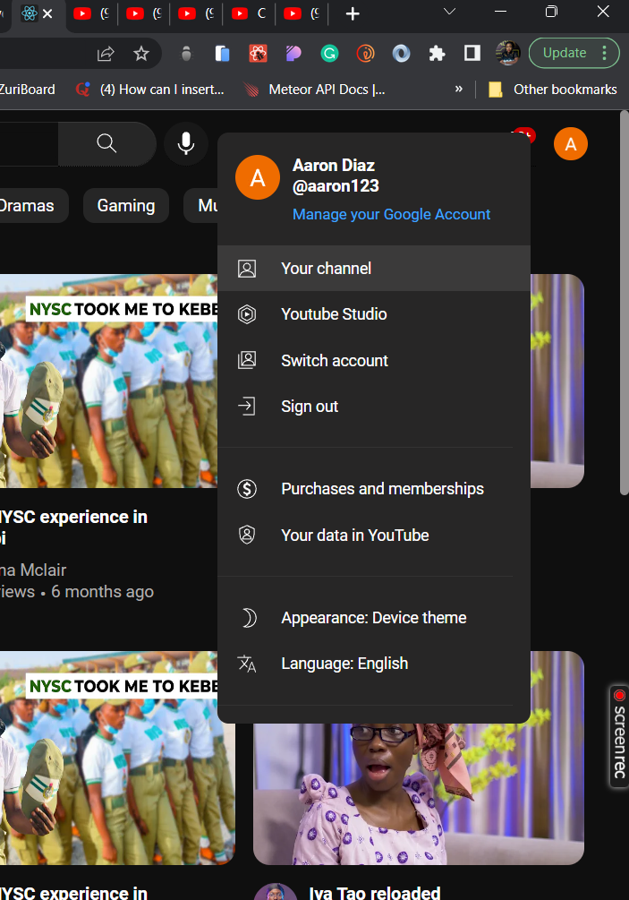
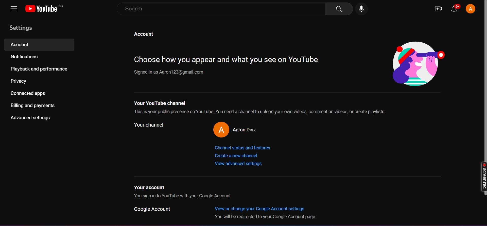

# Youtube Clone Day 3

The finished product will be to build a clone of YouTube and make it functional using Google Apis.

## Pages

- The Profile menu
- The settings page
- The navigation pages linked to the settings

[Live Link](https://vermilion4.github.io/youtube_clone)

# How to access

- Clicking on the profile icon on the navbar brings out the menu
  
- Clicking Settings leads to the settings page

# Preview

## How to run locally

- Clone the branch (pt-3) into your local machine
- cd into the folder (i.e youtube_clone) -[cd youtube_clone]
- Run 'npm install' in your terminal to install all dependencies
- Run 'npm start' to start the server
- Have fun 🥳
